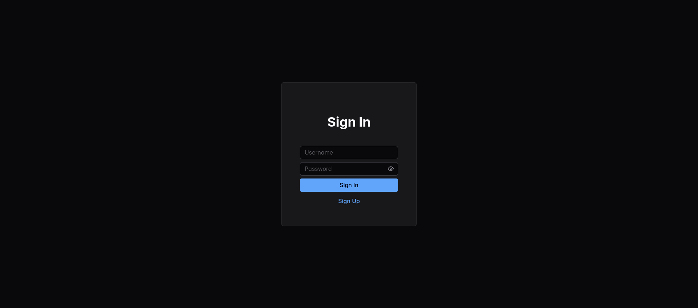
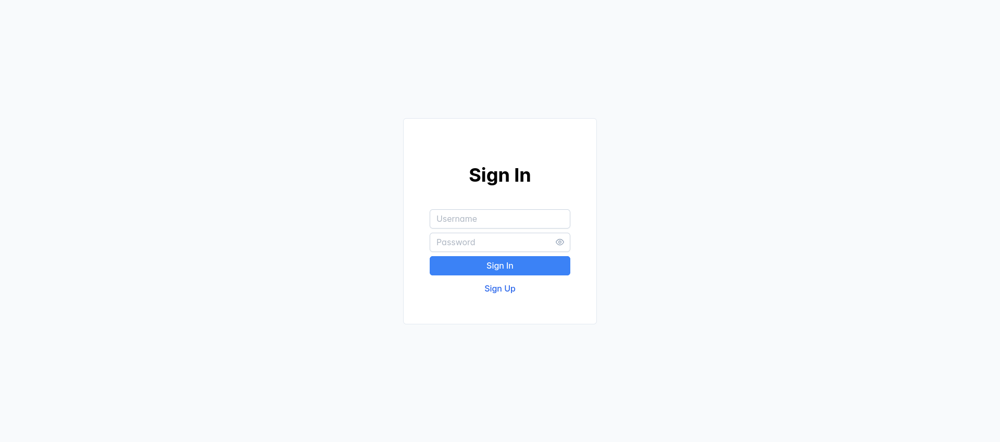
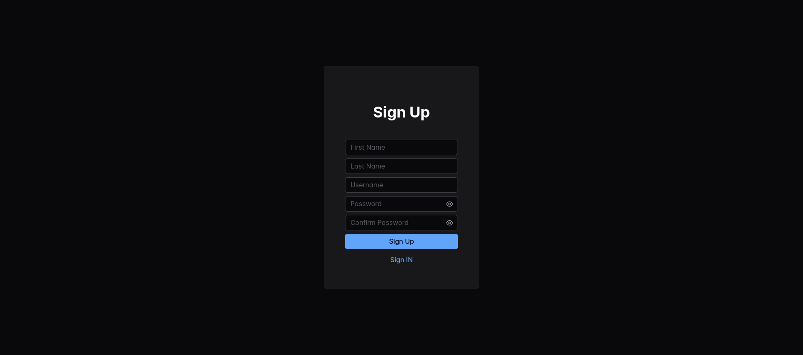
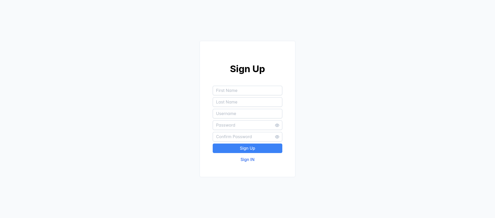
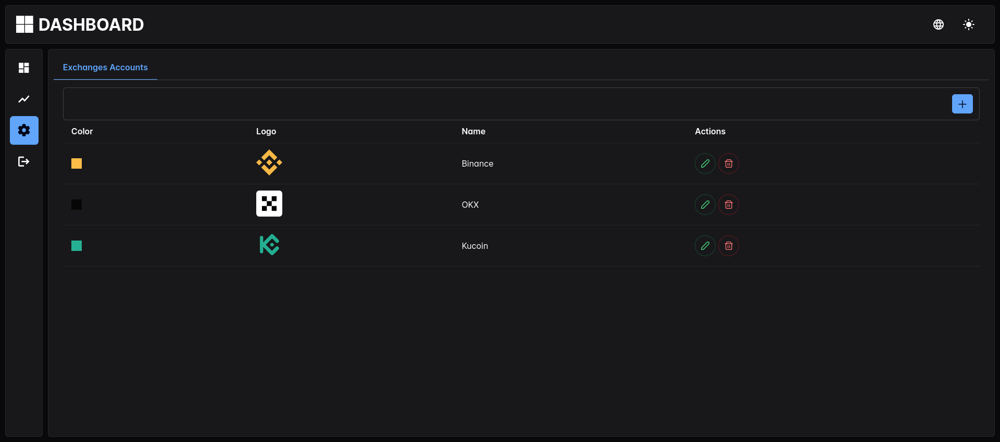
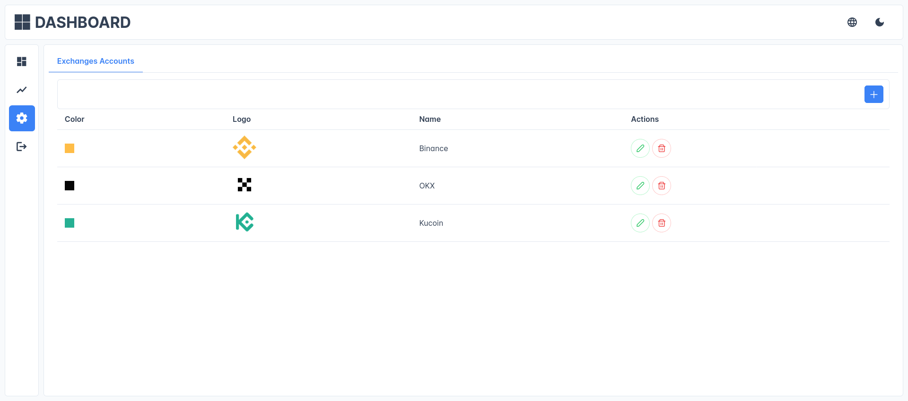

# CryptoExchangesDashboardAngular

## Overview

**CryptoExchangesDashboardAngular** is a comprehensive dashboard application designed to streamline the management of cryptocurrency exchanges from a single, user-friendly interface. Built with Angular 18 and PrimeNG, this project provides an intuitive and efficient way to oversee and interact with various exchange platforms.

## Features

- **Unified Dashboard:** Centralized view for managing multiple cryptocurrency exchanges.
- **Interactive Tables:** View and manage exchange data with dynamic tables.
- **Demo and Non-Demo API Sections:** Separate sections for interacting with demo and live APIs.
- **Responsive Design:** Optimized for both desktop and mobile devices.
- **Internationalization:** Built-in support for multiple languages using ngx-translate.

## Current Features

- **Settings:** Customize the application with various user preferences.

## Planned Features

### Dashboard Page
- Provide an overview of exchange performance, including key metrics like total volume, market trends, and active traders.

### Trading Page
- A dedicated interface for executing trades across multiple cryptocurrency exchanges with live data and trading tools.

### Users Page
- Manage user accounts and permissions, offering admin controls for adding, editing, and removing users.

## Technologies

- **Angular 18:** A powerful framework for building dynamic web applications.
- **PrimeNG:** A rich set of UI components for Angular applications.
- **ngx-translate:** A library for internationalization and localization.

## Getting Started

To get started with the project, follow these steps:

1. **Clone the Repository:**

   ```bash
   git clone https://github.com/salahaldinamera/crypto-exchanges-dashboard-angular.git
   cd crypto-exchanges-dashboard-angular


## Samples

### Sign In
- **Dark Mode**
  
- **Light Mode**
  

### Sign Up
- **Dark Mode**
  
- **Light Mode**
  
- 
### Settings
- **Dark Mode**
  
- **Light Mode**
  
